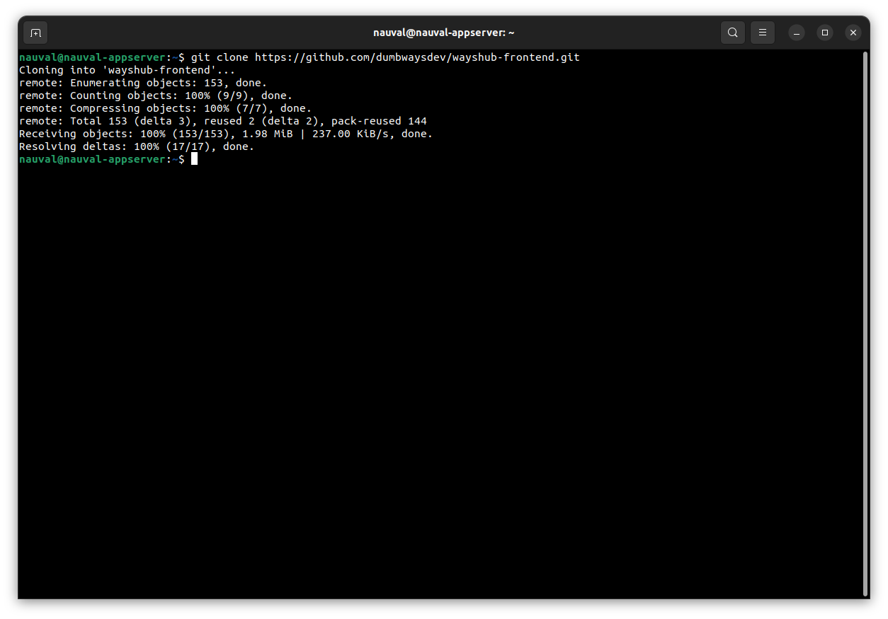
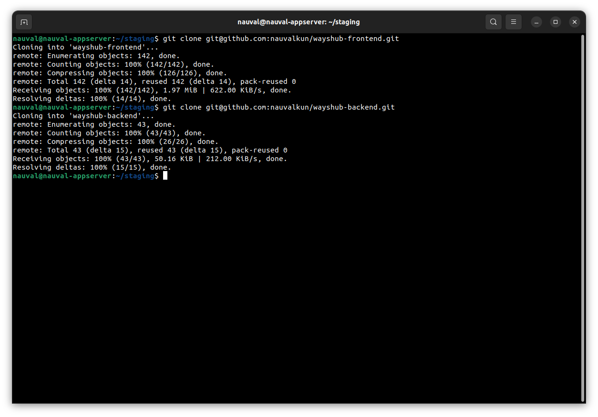
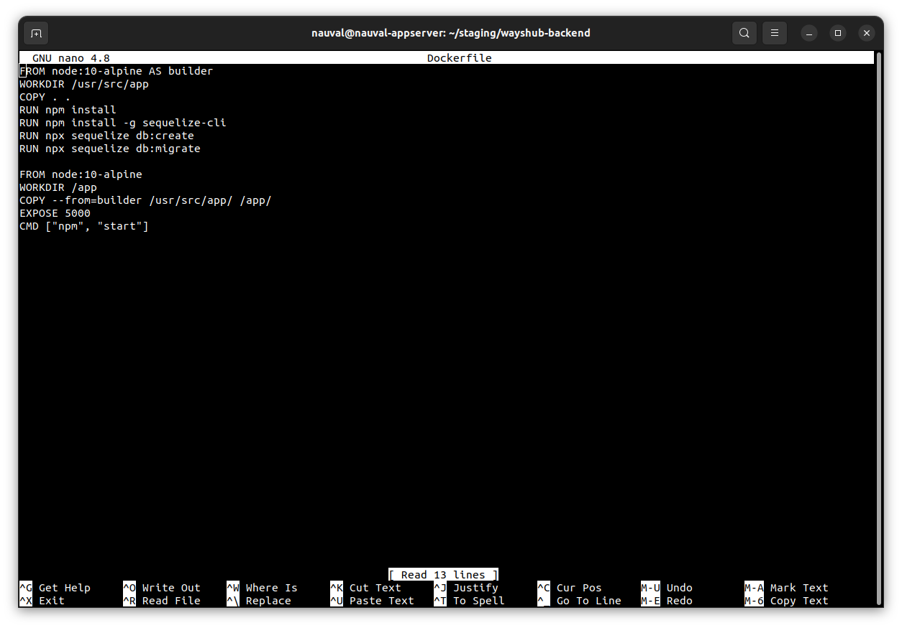
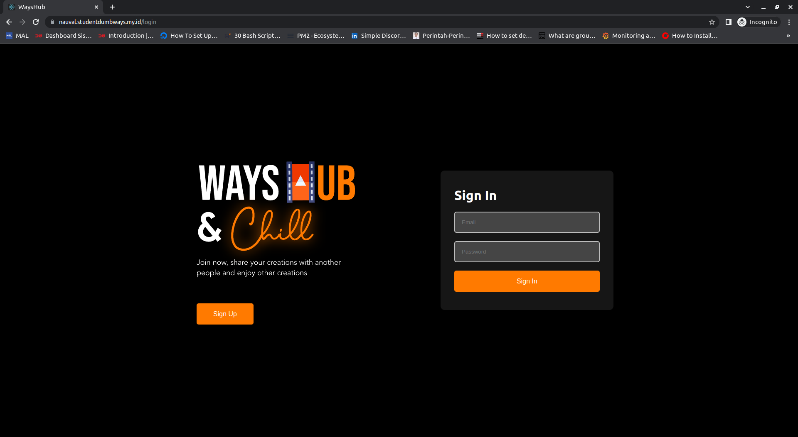
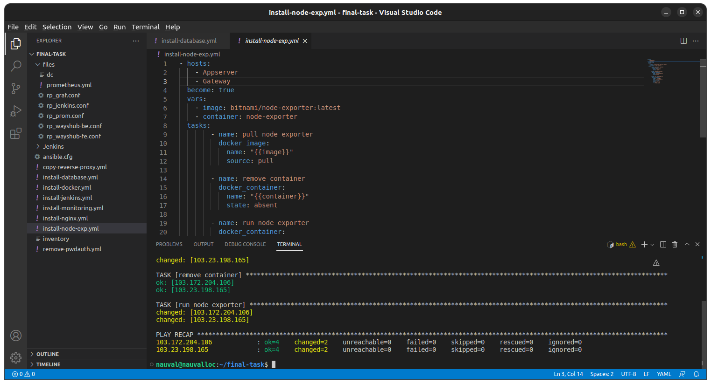
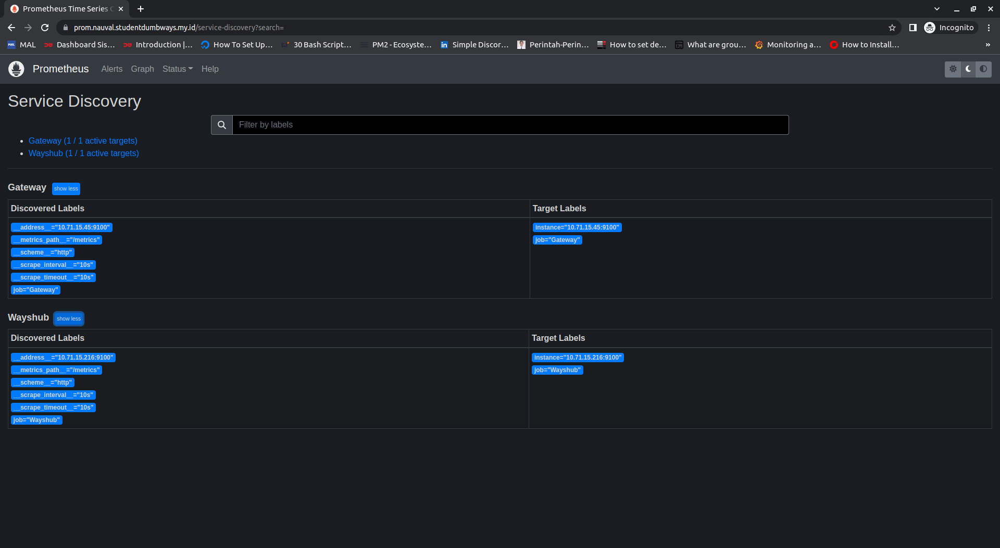
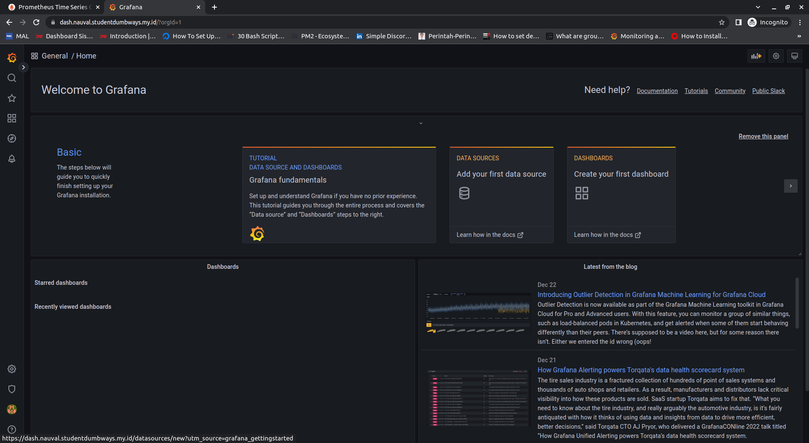
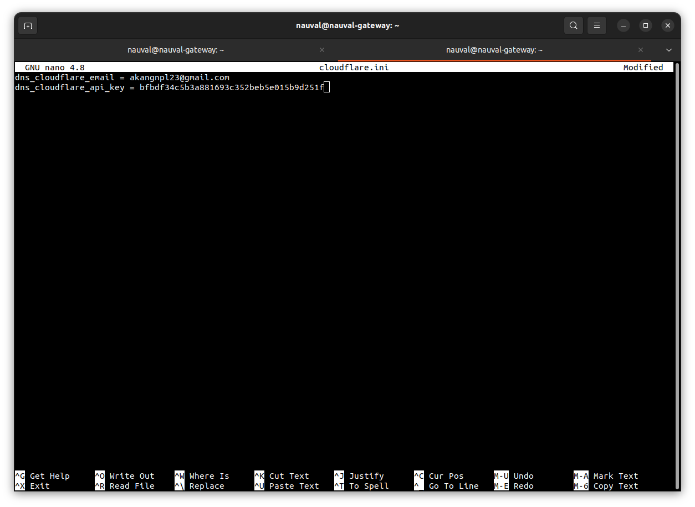

# Final-Task

## A. Cloud Computing

Pada Final Task kali ini, dimulai dengan cloud computing, dimana server yang kita buat, kita lakukan konfigurasi untuk mematikan Password Autenthication, dan meng-copy ```id_rsa.pub``` local kita ke file ```authorized_key``` yang ada pada Server, disini kita menggunakan *ansible-playbook*.


## B. SSH

Selanjutnya, kita generate *SSH* baru pada local kita, kemudian, *SSH* inilah yang nantinya akan kita gunakan untuk semua keperluan kita seperti push repo github, CI/CD, dll.


Kemudian, kita akan membuat konfigurasi *SSH*, ini dilakukan agar memudahkan kita dalam mengakses server-server yang kita punya, nantinya server dapat kita akses tanpa harus mengetik alamat IP, melainkan menggunakan alias.


Berikutnya, kita copy *directory SSH* yang sudah kita generate di awal tadi.


```bash
scp -r /lokasi/.ssh/kita username@IP:/lokasi/copy/diserver
```

## C. Repository

Pada tahap ini, kita diminta untuk membuat *Repository*, 3 *branch (development,staging,production)*.

1. Konfigurasikan server terlebih dahulu.


2. Copy isi ```id_rsa.pub``` untuk membuat *SSH Keys* di github, agar kita bisa mengakses menggunakan *SSH*.


3. Clone aplikasi yang akan kita push ke *Repository* kita dan juga hapus file ```.git``` kemudian kita ganti dengan yang baru.




4. Buat *Repository* pada github kita, lalu tambahkan remote pada aplikasi yang kita clone tadi untuk melakukan push. 


5. Buat branch baru dan push ke branch tersebut.


## D. Deployment

Pada tahap ini, kita akan melakukan beberapa persiapan untuk deployment menggunakan CI/CD.

1. Install Dokcer menggunakan *ansible-playbook*.


2. Buat 2 directory untuk nantinya kita melakukan CI/CD pada 2 branch.




3. Lakukan perubahan pada beberapa konfigurasi aplikasi. Baik *Frontend* maupun *Backend*.


4. Buat Dockerfile, di perlukan untuk membuild image yang nantinya akan di jalankan pada container.





5. Buat file ```docker-compose.yml``` .


6. Install database menggunakan *ansible-playbook*.


## E. CI/CD dengan Jenkins

Setelah kita melakukan persiapan deployment, tibalah sekarang untuk melakukan deploy aplikasi menggunakan CI/CD.

1. Install Jenkins menggunakna *ansible-playbook*.


2. Buka logs container Jenkins untuk melihat *Administrator Password* yang digunakan untuk installasi Jenkins.


3. Kita di arahkan untuk memilih install plugin Jenkins, disini kita bisa memilih Customize atau Recommended. Untuk saat ini kita pilih Customize.


Kita install plugin SSH Agent, karena kita akan menggunakan SSH untuk Pipeline Script.


4. Buat User dari Jenkins dan kita bisa tekan tombol next saja pada step berikutnya.


Ket : Tampilan Jenkins

5. Buat Credential, Pilih Manage Jenkins->Manage Credentials.


6. Setelan untuk Credential, Bagian Kind kita pilih *SSH Username with private key*. Kemudian copy id_rsa dari server aplikasi kita.


7. Tambahkan Webhook pada Repository Github kita. Ini dilakukan agar nantinya ketika kita melakukan push, build CI/CD akan berjalan otomatis.


8. Buat Job baru, dan lakukan konfigurasi, seperti memasukkan SSH Repository Github, branch, dll.


9. Install Plugin untuk Discord Notifier.


10. Melakukan Setup Discord Notifier, buat sebuah server discord. Masuk ke Setting->Integrations->Create Webhooks, lalu Copy Webhook URL.


11. Masuk ke job yang sudah kita buat, kemudian kita edit untuk melakukan generate link job notif dari Jenkins. Configure Job Scroll ke paling bawah, klik Pipeline Syntax


Link yang sudah di Generate kita masukkan ke Jenkinsfile Pipeline Script yang kita buat.

12. Buat Jenskinsfile Pipeline Script. Lakukan pada Frontend dan Backend.


13. Lalu kita push aplikasi ke Repository kita dan juga branchnya. Karena kita sudah memasang Webhook pada Repository, maka Build akan berjalan dengan otomatis.





## F. Monitoring

Selanjutnya Monitoring. Ada 3 hal yang kita perlukan untuk Memonitoring Server, yaitu Node Exporter, Prometheus, dan Grafana.

1. Install Node Exporter pada server yang akan kita monitor menggunakan *ansible-playbook*.



2. Install juga Prometheus dan Grafana pada server monitoring menggunakan *ansible-playbook*.


3. Check apakah Prometheus sudah menangkap metrics dari server yang kita install Node Exporter.




4. Akses Grafana menggunakan Domain yang kita buat.




5. Buat data source untuk pembuatan dashboard.


6. Kita perlu Template dashboard dari dokumentasi website [Grafana](https://grafana.com/grafana/dashboards/?src=ggl-s&mdm=cpc&camp=nb-hashicorp-vault-bmm&cnt=130557757818&trm=vault%20grafana%20dashboard&device=c&gclid=Cj0KCQiA45qdBhD-ARIsAOHbVdHvRoPbbZkTIkMkZAnc1xjIF4NltDeSeSIppjNHcYLomfT2Vg-yV_oaAqPGEALw_wcB).


## G. Webserver

Setelah semuanya sudah berjalan, selanjutnya kita akan membuat Reverse Proxy untuk semua aplikasi tadi.

1. Buat Domain dan pasang IP Gateway.


2. Install Nginx menggunakan *ansible-playbook*.


3. Copy file konfigurasi Reverse Proxy menggunakan *ansible-playbook*.


4. Install Certbot untuk mendapatkan SSL Certificate. Step lengkapnya ada pada Website [Certbot](https://certbot.eff.org/instructions?ws=nginx&os=ubuntufocal).


5. Setup Credentials sesuai dengan plugin. Disini kita menggunakan Cloudflare.





6. Request Certificate.


Sekian dokumentasi saya pada Final Task Bootcamp Dumbways, Kurang lebihnya saya mohon maaf.

Terima Kasih.